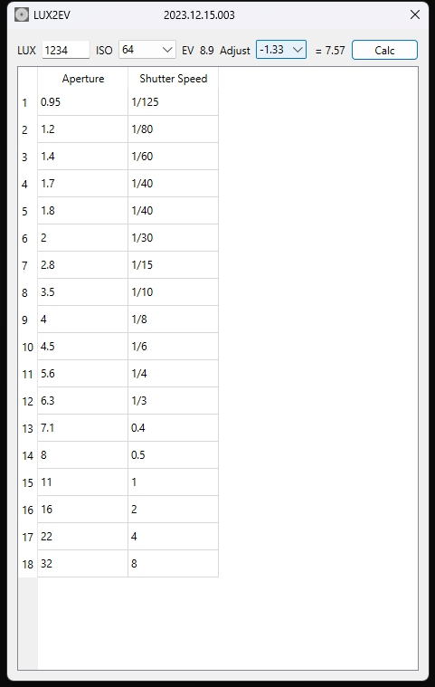

# LUX2EV

A very easy-to-use small software that uses the lux value measured by the illuminance meter to calculate the shutter speed under different ISO and aperture, and assist photography.


## Prerequisites

- Python 3.9+
- PyQt6

## Installation

```bash
pip install pyqt6
```

## Usage

```bash
python LUX2EV.py
```

Just input the Lux and ISO values, and the software will calculate the shutter speed under different aperture.
